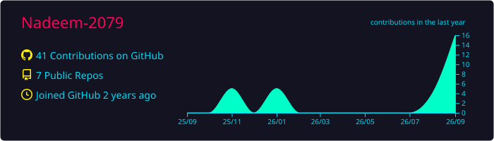
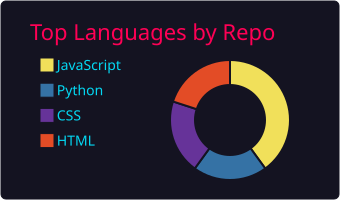
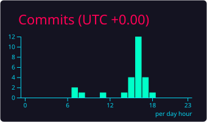
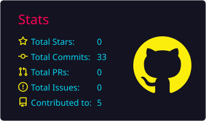
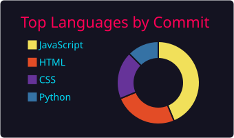

<!-- 1. TOP WIDE BANNER -->
<p align="center">
  
</p>

<!-- 2. DYNAMIC TYPING WAVE ANIMATION (JETBRAINS MONO FONT) -->
<p align="center">
  <a href="https://github.com/Nadeem-2079">
    
  </a>
</p>

<p align="center">
  
</p>

<br/>

<!-- 3. ABOUT ME SPLIT SECTION -->
### 📌 About Me

<table>
  <tr>
    <td width="58%" valign="top">

```json
{
  "name": "Mohammed Nadeem A",
  "role": "Full-Stack Developer",
  "location": "Chennai, India",
  "building": [
    "Production Web Platforms",
    "Scalable Mobile Apps"
  ],
  "learning": [
    "System Design",
    "Distributed Systems"
  ],
  "tech": {
    "frontend": ["React", "Next.js", "Tailwind CSS"],
    "mobile": ["React Native", "Expo", "Flutter"],
    "backend": ["Node.js", "Express", "Python"],
    "database": ["PostgreSQL", "MongoDB"]
  }
}
```

> *"Simplicity is prerequisite for reliability."* — **Edsger W. Dijkstra**

</td>
    <td width="42%" align="center" valign="middle">
      
    </td>
  </tr>
</table>

<br/>

<!-- 4. CONNECT WITH ME -->
### 🔗 Connect With Me

<p align="left">
  <a href="https://www.linkedin.com/in/mohammednadeem2079/" target="_blank">
    
  </a>
  <a href="https://github.com/Nadeem-2079" target="_blank">
    
  </a>
  <a href="https://www.instagram.com/_ndm.18_/" target="_blank">
    
  </a>
  <a href="mailto:mdnadeem2079@gmail.com">
    
  </a>
</p>

<br/>

<!-- 5. TECH STACK -->
### 🛠️ Tech Stack

<p align="left">
  
</p>

<p align="left">
  
  
  
  
  
  
  
  
</p>

<br/>

<!-- 6. FEATURED PROJECTS (DYNAMIC REPO CARDS) -->
### 🚀 Featured Projects

<p align="center">
  <a href="https://github.com/Nadeem-2079/Lendr" target="_blank">
    
  </a>
  <a href="https://github.com/Nadeem-2079/Nadeem-2079" target="_blank">
    
  </a>
</p>

<br/>

<!-- 7. GITHUB ANALYTICS -->
### 📊 GitHub Analytics

<!-- Top Profile Details -->
<p align="center">
  
</p>

<!-- Row 1: Languages by Repo + Productive Time -->
<p align="center">
  
  
</p>

<!-- Row 2: Stats + Languages by Commit -->
<p align="center">
  
  
</p>

<br/>

<!-- 8. ANIMATED SNAKE CONTRIBUTION GRAPH -->
### 🐍 Contribution Activity

<p align="center">
  <picture>
    <source media="(prefers-color-scheme: dark)" srcset="https://raw.githubusercontent.com/Nadeem-2079/Nadeem-2079/output/github-contribution-grid-snake.svg" />
    <source media="(prefers-color-scheme: light)" srcset="https://raw.githubusercontent.com/Nadeem-2079/Nadeem-2079/output/github-contribution-grid-snake.svg" />
    
  </picture>
</p>

<br/>

<!-- 9. FOOTER WAVE -->
<p align="center">
  
</p>
